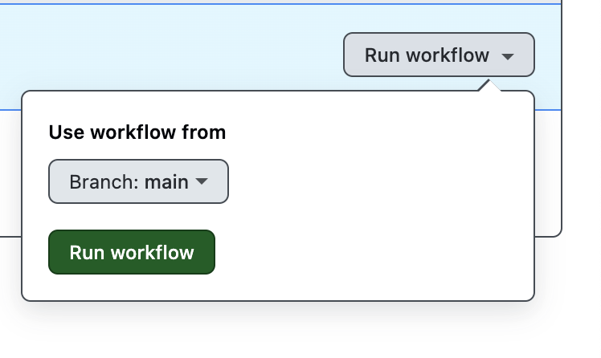

# Democentral Playwright PoC

## Overview

This repository contains the end-to-end (E2E) test solution for the Emil Group coding challenge. The framework has been developed and tested with specific system requirements to ensure optimal performance.

## Development Environment

### System Requirements

- **Operating System:** Mac OS Sonoma Version 14.6.1 (Apple M1 Pro)
- **IDE:** Visual Studio Code
- **Node.js Version:** v23.1.0
- **Yarn Version:** v1.22.19

## How to Run Test

### 1. Run on local terminal

#### Prerequisites

- Node.js version > 18.0.0 (recommended: v23.1.0)
  - Download from: [Node.js Source Code](https://nodejs.org/en/download/source-code)
  - Follow installation steps provided on the website
- Yarn package manager
  - Install using: `npm install --global yarn`

#### Steps to Execute

1. Clone the repository:

   ```bash
   git clone git@github.com:gauravrajput44/emil-e2e-automation.git
   cd emil-e2e-automation
   ```

2. Install dependencies:

   ```bash
   yarn install
   ```

3. Run tests: By default tests are executed on 3 browsers(chromium, firefox and webkit) and in headless mode

   ```bash
   yarn test
   ```

4. Run test on specific browser:
   ```bash
   yarn test --project firefox //Test would be executed in firefox
   yarn test --project webkit //Test would be executed in webkit
   ```
5. Run test in headed browser mode

   ```bash
   yarn test --headed
   ```

6. Open report:
   ```bash
   yarn open-report
   ```

### 2. Docker Execution

#### Steps to Execute

1. Build the Docker image:

   ```bash
   docker build -t playwright-tests .
   ```

2. Map the docker volume with local host to open the report:

   ```bash
   docker run -v $(pwd)/playwright-report:/app/playwright-report playwright-tests
   ```

3. View the test report:
   ```bash
   yarn open-report
   ```

### 3. Github action

Go to github [action](https://github.com/gauravrajput44/emil-e2e-automation/actions/workflows/playwright.yml) and use the run workflow to execute the tests in the CI



## Additional Information

- The framework is configured to run E2E tests using Playwright
- Test reports are generated automatically after test execution
- Reports can be accessed locally when using either execution method
- Failed screenshots are captured if test is failed

## Future Enhancement:

- Add recorded video execution for failed test scenario
- Capture failed HTTP request/response in failure scenario
- Capture browser console log
- Integrate other reporting tool for e.g. Allure Playwright
